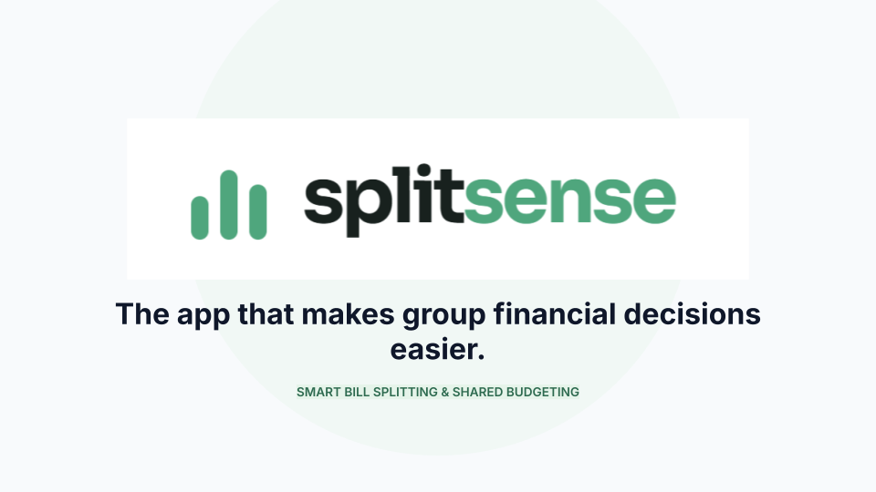
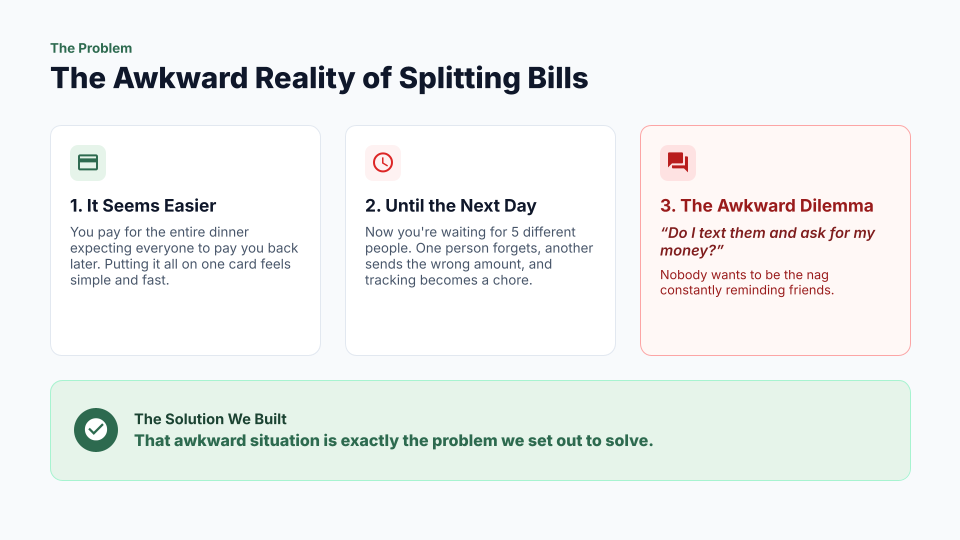
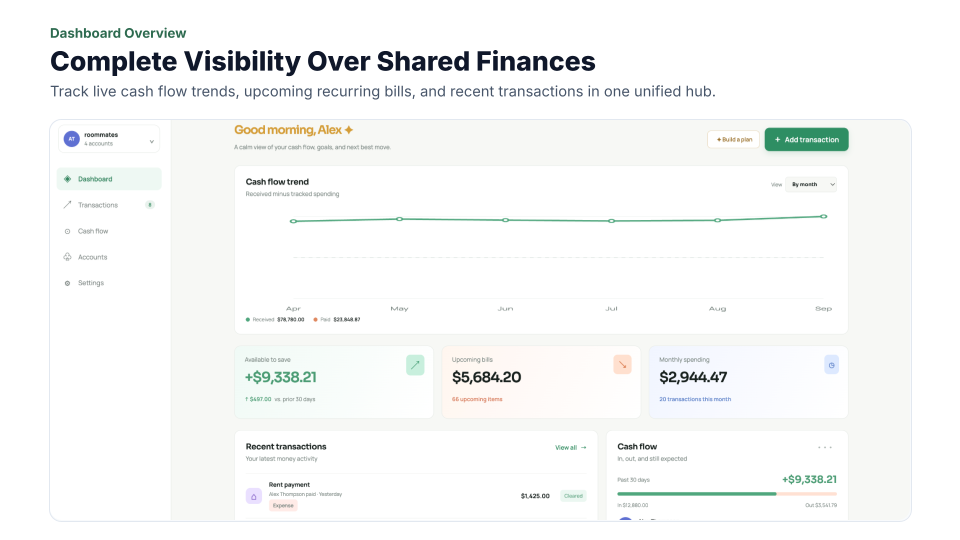
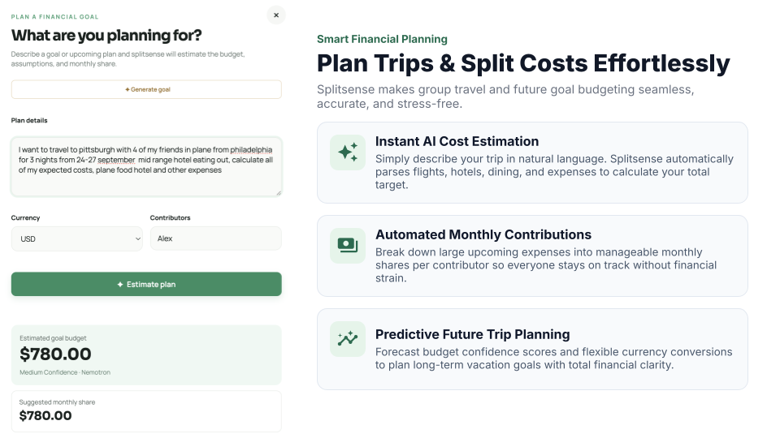
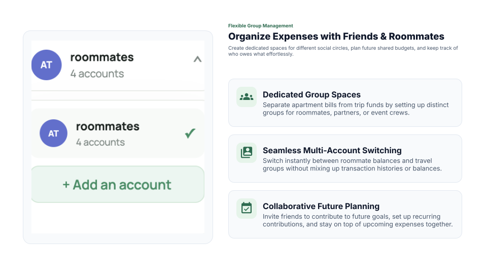

# SplitSense



SplitSense is a smart shared-expense assistant built to make group finances easier, more transparent, and less awkward. It helps roommates, friends, and travel groups understand who paid, who was part of the expense, and how the total should be divided fairly.

The app combines natural-language expense parsing, rule-based splitting logic, and NVIDIA Nemotron-powered financial analysis to deliver a polished budgeting experience.

## Why this project exists



Shared expenses are one of the easiest ways for groups to lose track of money. A dinner bill, a hotel stay, a weekend trip, or a shared purchase often leads to confusion about:

- who paid
- who actually benefited from the expense
- who should be excluded if they were not there
- how to split the cost fairly

SplitSense solves that by turning messy text descriptions into a structured expense result and clear financial breakdown.

## What SplitSense does





SplitSense helps users:

- enter an expense description in plain language
- identify the payer automatically from the text
- detect whether someone should be excluded from the split
- compute fair per-person amounts
- analyze trip and financial goal planning for a group
- view a dashboard-style frontend for managing shared finances

### Core features

1. Expense classification
   - Understands text such as “Sam paid $84 for dinner, Alex wasn’t there”
   - Detects category: food, transport, lodging, or misc
   - Flags participants who should not be included

2. Split calculations
   - Divides amounts evenly across the appropriate group
   - Supports excluded-member splitting logic
   - Returns a person-by-person breakdown

3. Goal and trip planning
   - Estimates trip costs based on descriptions like flights, nights, hotel stays, and meals
   - Analyzes a financial goal and proposes a practical contribution plan
   - Uses structured output for per-person share estimates

4. AI-assisted intelligence
   - Uses NVIDIA Nemotron to interpret natural-language prompts and return structured JSON
   - Includes a rule-based fallback when model output is unavailable or malformed

5. Responsive frontend
   - Provides a dashboard with a financial workspace feel
   - Lets users interact with expense, goal, and trip planning flows

## How the app works

The product uses a hybrid system: deterministic rules for reliability, and AI inference for richer understanding.

### Backend flow

1. User enters a transaction or planning prompt.
2. The Flask app receives the request and parses the group members and payer.
3. A heuristic classifier checks for obvious signals such as food names, hotel mentions, and absence phrases.
4. The app attempts to use Nemotron to classify the expense or estimate the goal.
5. If the AI response fails or is invalid, the app falls back to the local rule engine.
6. The system computes the split and returns a JSON payload to the frontend.

### Example logic

If a message says:

> “Sam paid $90 for dinner. Alex wasn’t there.”

The system can infer:

- payer = Sam
- category = food
- excluded participant = Alex
- split is calculated across the remaining group members

This keeps the experience practical even when the input is informal or messy.

## Project architecture

The repository is organized into a small but complete web app:

- app.py: Flask app and REST endpoints
- split_logic.py: expense classification and equal split logic
- nemotron_client.py: NVIDIA API integration and response parsing
- frontend/: dashboard UI assets
- tests/: verification for split logic and route behavior
- requirements.txt: Python dependencies

## Tech stack

- Python
- Flask
- HTML, CSS, JavaScript
- NVIDIA Nemotron API
- Requests library
- pytest for automated tests

## File overview

### app.py

This file hosts the main Flask server and API endpoints.

It includes routes for:

- /
- /classify
- /split
- /expense-analysis
- /goal-analysis
- /trip-analysis
- /health

These endpoints accept user input and return structured JSON used by the frontend or downstream tools.

### split_logic.py

This file contains the core business logic for expense classification and split calculation.

Key functions:

- classify_expense()
- compute_split()

The logic extracts category, participant inclusion/exclusion, and split hints using straightforward rule-based logic.

### nemotron_client.py

This is the AI integration layer for the app.

It:

- loads NVIDIA settings from environment variables or secrets
- calls the NVIDIA chat/completions API
- extracts valid JSON from model responses
- classifies expenses using model prompts
- plans trip costs and analyzes financial goals
- provides fallback behavior when the model is unavailable

### frontend/

This directory contains the interactive dashboard and UI for the app. It gives the project a more realistic product feel and helps users interact with planning flows visually.

### tests/

The test suite verifies:

- expense classification behavior
- correct splitting logic
- API contract consistency for routes
- trip and goal analyses

## Setup and installation

1. Open a terminal in the project root.
2. Create and activate a virtual environment if needed.
3. Install dependencies:

```bash
pip install -r requirements.txt
```

4. Set up your NVIDIA API key if you want the AI features enabled.

Example environment variables:

```bash
export NVIDIA_API_KEY="your_key_here"
export NVIDIA_BASE_URL="https://integrate.api.nvidia.com/v1"
export NVIDIA_MODEL="nvidia/nemotron-3-super-120b-a12b"
```

If the key is missing, the app still has rule-based functionality, but AI-powered analysis may not work.

## Running the app

Start the Flask server with:

```bash
python app.py
```

Then open the app in your browser at:

```text
http://localhost:8000/
```

## API examples

### Expense classification

```bash
curl -X POST "http://localhost:8000/classify" \
  -d "text=Sam paid $84 for dinner at Nonna's. Alex wasn't there." \
  -d "payer=Sam" \
  -d "group=Alex" \
  -d "group=Sam" \
  -d "group=Priya" \
  -d "group=Leo"
```

### Split calculation

```bash
curl -X POST "http://localhost:8000/split" \
  -d "amount=84" \
  -d "split_hint=exclude_named" \
  -d "group=Alex" \
  -d "group=Priya" \
  -d "group=Leo"
```

### Trip planning

```bash
curl -X POST "http://localhost:8000/trip-analysis" \
  -d "trip=Three nights in Lisbon" \
  -d "currency=EUR" \
  -d "group=Alex" \
  -d "group=Sam" \
  -d "group=Priya"
```

## Challenges faced

A major challenge was balancing intelligence with reliability. The app needed to do more than just calculate a number—it had to interpret messy natural-language expense input and decide who should share the burden.

Another challenge was handling ambiguous cases where groups may include someone who is absent, not participating, or simply not mentioned in the text. The product needed a clear but flexible interpretation strategy.

Finally, we built in a fallback system so the app remains useful even if the AI service is unavailable or returns invalid JSON.

## What we learned

This project highlighted the value of combining deterministic logic with AI assistance.

We learned that:

- rule-based logic is useful for explainability and reliability
- AI improves interpretation when the input is conversational or inconsistent
- a product is most useful when it reduces unclear decisions, not just performs math
- strong APIs and interface contracts make a small app feel much more robust

## Accomplishments

We created a working MVP that demonstrates:

- smart expense classification
- fair split calculations
- natural-language understanding
- group financial planning
- polished user interface design

This gave us a strong foundation for a product that could eventually become a real shared-finance platform.

## Future improvements

The next iteration of SplitSense could include:

- user authentication and saved accounts
- persistent group management and historical transactions
- automatic debt settlement suggestions
- richer analytics and spending trends
- mobile optimization
- internationalization and multi-currency improvements
- direct app integrations for payment tracking

## Final note

SplitSense is designed to make shared money feel less stressful and more transparent. It turns confusing group expenses into clear, actionable financial decisions so people can focus on the experience instead of the bookkeeping.

